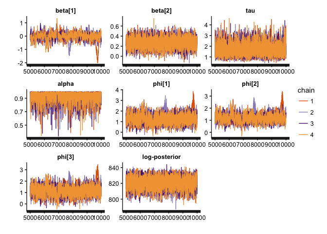
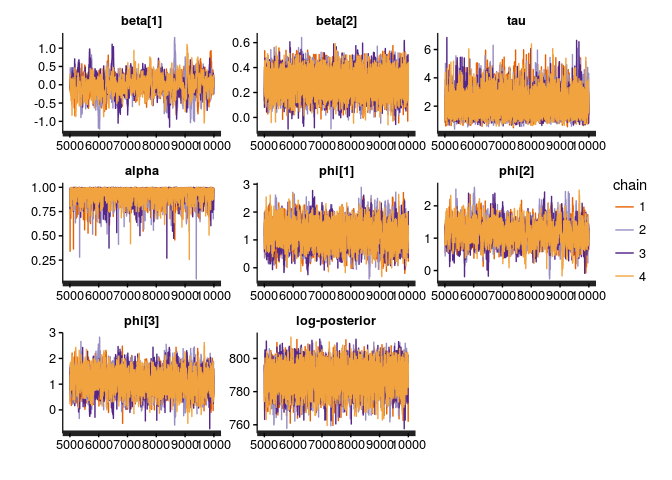
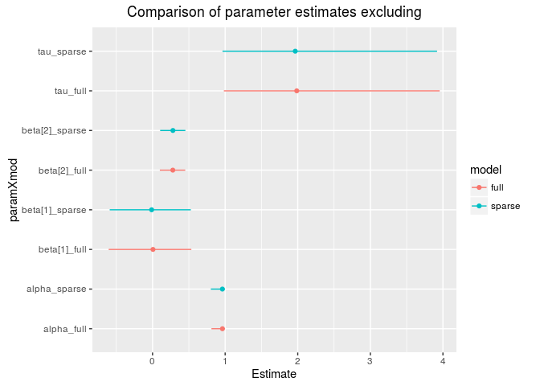

# Exact sparse CAR models in Stan
Max Joseph  
August 20, 2016  


This document details sparse exact conditional autoregressive (CAR) models in Stan as an extension of previous work on approximate sparse CAR models in Stan. 
Sparse representations seem to give order of magnitude efficiency gains, scaling better for large spatial data sets. 

## CAR priors for spatial random effects

Conditional autoregressive (CAR) models are popular as prior distributions for spatial random effects with areal spatial data. 
If we have a random quantity $\phi = (\phi_1, \phi_2, ..., \phi_n)'$ at $n$ areal locations, the CAR model is often expressed via full conditional distributions:

$$\phi_i \mid \phi_j, j \neq i \sim N(\alpha \sum_{j = 1}^n b_{ij} \phi_j, \tau_i^{-1})$$

where $\tau_i$ is a spatially varying precision parameter, and $b_{ii} = 0$. 

By Brook's Lemma, the joint distribution of $\phi$ is then:

$$\phi \sim N(0, [D_\tau (I - \alpha B)]^{-1}).$$

If we assume the following:

- $D_\tau = \tau D$
- $D = diag(m_i)$: an $n \times n$ diagonal matrix with $m_i$ = the number of neighbors for location $i$
- $I$: an $n \times n$ identity matrix
- $\alpha$: a parameter that controls spatial dependence ($\alpha = 0$ implies spatial independence, and $\alpha = 1$ collapses to an *intrisnic conditional autoregressive* (IAR) specification)
- $B = D^{-1} W$: the scaled adjacency matrix
- $W$: the adjacency matrix ($w_{ii} = 0, w_{ij} = 1$ if $i$ is a neighbor of $j$, and $w_{ij}=0$ otherwise)

then the CAR prior specification simplifies to: 

$$\phi \sim N(0, [\tau (D - \alpha W)]^{-1}).$$

The $\alpha$ parameter ensures propriety of the joint distrbution of $\phi$ as long as $| \alpha | < 1$ (Gelfand & Vounatsou 2003).
However, $\alpha$ is often taken as 1, leading to the IAR specification which creates a singular precision matrix and an improper prior distribution.

## A Poisson specification

Suppose we have aggregated count data $y_1, y_2, ..., y_n$ at $n$ locations, and we expect that neighboring locations will have similar counts. 
With a Poisson likelihood: 

$$y_i \sim \text{Poisson}(\text{exp}(X_{i} \beta + \phi_i + \log(\text{offset}_i)))$$

where $X_i$ is a design vector (the $i^{th}$ row from a design matrix), $\beta$ is a vector of coefficients, $\phi_i$ is a spatial adjustment, and $\log(\text{offset}_i)$ accounts for differences in expected values or exposures at the spatial units (popular choices include area for physical processes, or population size for disease applications). 

If we specify a proper CAR prior for $\phi$, then we have that $\phi \sim \text{N}(0, [\tau (D - \alpha W)]^{-1})$ where $\tau (D - \alpha W)$ is the precision matrix $\Sigma^{-1}$.
A complete Bayesian specification would include priors for the remaining parameters $\alpha$, $\tau$, and $\beta$, such that our posterior distribution is: 

$$p(\phi, \beta, \alpha, \tau \mid y) \propto p(y \mid \beta, \phi) p(\phi \mid \alpha, \tau) p(\alpha) p(\tau) p(\beta)$$

## Example: Scottish lip cancer data

To demonstrate this approach we'll use the Scottish lip cancer data example (some documentation [here](https://cran.r-project.org/web/packages/CARBayesdata/CARBayesdata.pdf)). 
This data set includes observed lip cancer case counts at 56 spatial units in Scotland, with an expected number of cases to be used as an offset, and an area-specific continuous covariate that represents the proportion of the population employed in agriculture, fishing, or forestry.
The model structure is identical to the Poisson model outlined above. 

<!-- -->

Let's start by loading packages and data, specifying the number of MCMC iterations and chains.


```r
library(ggmcmc)
library(dplyr)
library(rstan)
rstan_options(auto_write = TRUE)
options(mc.cores = parallel::detectCores())
source('scotland_lip_cancer.RData')

# Define MCMC parameters 
niter <- 1E4   # definitely overkill, but good for comparison
nchains <- 4
```

To fit the full model, we'll pull objects loaded with our Scotland lip cancer data. 
I'll use `model.matrix` to generate a design matrix, centering and scaling the continuous covariate `x` to reduce correlation between the intercept and slope estimates. 


```r
W <- A # adjacency matrix
D <- diag(rowSums(A))
scaled_x <- c(scale(x))
X <- model.matrix(~scaled_x)
  
full_d <- list(n = nrow(X),         # number of observations
               p = ncol(X),         # number of coefficients
               X = X,               # design matrix
               y = O,               # observed number of cases
               log_offset = log(E), # log(expected) num. cases
               W = W,               # adjacency matrix
               D = D)               # diagonal num. neighbor matrix
```

#### Stan model statement: CAR with `multi_normal_prec`

Our model statement mirrors the structure outlined above, with explicit normal and gamma priors on $\beta$ and $\tau$ respectively, and a $\text{Uniform}(0, 1)$ prior for $\alpha$. 
The prior on $\phi$ is specified via the `multi_normal_prec` function, passing in $\tau (D - \alpha W)$ as the precision matrix.


```
data {
  int<lower = 1> n;
  int<lower = 1> p;
  matrix[n, p] X;
  int<lower = 0> y[n];
  vector[n] log_offset;
  matrix<lower = 0, upper = 1>[n, n] W;
  matrix<lower = 0>[n, n] D;
}
transformed data{
  vector[n] zeros;
  zeros = rep_vector(0, n);
}
parameters {
  vector[p] beta;
  vector[n] phi;
  real<lower = 0> tau;
  real<lower = 0, upper = 1> alpha;
}
model {
  phi ~ multi_normal_prec(zeros, tau * (D - alpha * W));
  beta ~ normal(0, 1);
  tau ~ gamma(0.5, .0005);
  y ~ poisson_log(X * beta + phi + log_offset);
}
```

Fitting the model with `rstan`:


```r
full_fit <- stan('stan/car_prec.stan', data = full_d, 
                 iter = niter, chains = nchains, verbose = FALSE)
print(full_fit, pars = c('beta', 'tau', 'alpha', 'lp__'))
```

```
## Inference for Stan model: car_prec.
## 4 chains, each with iter=10000; warmup=5000; thin=1; 
## post-warmup draws per chain=5000, total post-warmup draws=20000.
## 
##           mean se_mean   sd   2.5%    25%    50%    75%  97.5% n_eff Rhat
## beta[1]   0.00    0.01 0.28  -0.60  -0.15   0.01   0.16   0.53   360    1
## beta[2]   0.28    0.00 0.09   0.10   0.22   0.28   0.34   0.45  4306    1
## tau       2.11    0.01 0.78   0.98   1.57   1.99   2.53   3.96  4062    1
## alpha     0.95    0.00 0.05   0.81   0.93   0.96   0.98   1.00  3573    1
## lp__    826.72    0.13 7.39 811.39 821.88 827.11 831.79 840.42  3226    1
## 
## Samples were drawn using NUTS(diag_e) at Wed Aug 24 23:19:57 2016.
## For each parameter, n_eff is a crude measure of effective sample size,
## and Rhat is the potential scale reduction factor on split chains (at 
## convergence, Rhat=1).
```

```r
# visualize results 
to_plot <- c('beta', 'tau', 'alpha', 'phi[1]', 'phi[2]', 'phi[3]', 'lp__')
traceplot(full_fit, pars = to_plot)
```

<!-- -->

### A more efficient sparse representation

Although we could specify our multivariate normal prior for $\phi$ directly in Stan via `multi_normal_prec`, as we did above, in this case we will accrue computational efficiency gains by manually specifying $p(\phi \mid \tau, \alpha)$ directly via the log probability accumulator. 
The log probability of $\phi$ is: 

$$\log(p(\phi \mid \tau, \alpha)) = - \frac{n}{2} \log(2 \pi) + \frac{1}{2} \log(\text{det}( \Sigma^{-1})) - \frac{1}{2} \phi^T \Sigma^{-1} \phi$$

In Stan, we only need the log posterior up to an additive constant so we can drop the first term. 
Then, substituting  $\tau (D - \alpha W)$ for $\Sigma^{-1}$:

$$\frac{1}{2} \log(\text{det}(\tau (D - \alpha W))) - \frac{1}{2} \phi^T \Sigma^{-1} \phi$$

$$ = \frac{1}{2} \log(\tau ^ n \text{det}(D - \alpha W)) - \frac{1}{2} \phi^T \Sigma^{-1} \phi$$

$$ = \frac{n}{2} \log(\tau) + \frac{1}{2} \log(\text{det}(D - \alpha W)) - \frac{1}{2} \phi^T \Sigma^{-1} \phi$$

There are two ways that we can accrue computational efficiency gains: 

1. Sparse representations of $\Sigma^{-1}$ to expedite computation of $\phi^T \Sigma^{-1} \phi$ (this work was done by Kyle foreman previously, e.g., https://groups.google.com/d/topic/stan-users/M7T7EIlyhoo/discussion). 

2. Efficient computation of the determinant. Jin, Carlin, and Banerjee (2005) show that:

$$\text{det}(D - \alpha W) \propto \prod_{i = 1}^n (1 - \alpha \lambda_i)$$

where $\lambda_1, ..., \lambda_n$ are the eigenvalues of $D^{-\frac{1}{2}} W D^{-\frac{1}{2}}$, which can be computed ahead of time and passed in as data. 
Because we only need the log posterior up to an additive constant, we can use this result which is proportional up to some multiplicative constant $c$: 

$$\frac{n}{2} \log(\tau) + \frac{1}{2} \log(c \prod_{i = 1}^n (1 - \alpha \lambda_i)) - \frac{1}{2} \phi^T \Sigma^{-1} \phi$$

$$= \frac{n}{2} \log(\tau) + \frac{1}{2} \log(c) +  \frac{1}{2} \log(\prod_{i = 1}^n (1 - \alpha \lambda_i)) - \frac{1}{2} \phi^T \Sigma^{-1} \phi$$

Again dropping additive constants: 

$$\frac{n}{2} \log(\tau) + \frac{1}{2} \log(\prod_{i = 1}^n (1 - \alpha \lambda_i)) - \frac{1}{2} \phi^T \Sigma^{-1} \phi$$

$$= \frac{n}{2} \log(\tau) + \frac{1}{2} \sum_{i = 1}^n \log(1 - \alpha \lambda_i) - \frac{1}{2} \phi^T \Sigma^{-1} \phi$$

Below, we first compute $\lambda_1, ..., \lambda_n$ (the eigenvalues of $D^{-\frac{1}{2}} W D^{-\frac{1}{2}}$), then generate a sparse representation for W (`Wsparse`), which is assumed to be symmetric, such that the adjacency relationships can be represented in a two column matrix where each row is an adjacency relationship between two sites. 


```r
# get eigenvalues of D^(-.5) * W * D^(-.5) for determinant computations
invsqrtD <- diag(1 / sqrt(diag(D)))
quadformDAD <- invsqrtD %*% W %*% invsqrtD
lambda <- eigen(quadformDAD)$values

# from Kyle Foreman:
Wsparse <- which(W == 1, arr.ind = TRUE)
Wsparse <- Wsparse[Wsparse[, 1] < Wsparse[, 2], ]  # removes duplicates

sp_d <- list(n = nrow(X),         # number of observations
             p = ncol(X),         # number of coefficients
             X = X,               # design matrix
             y = O,               # observed number of cases
             log_offset = log(E), # log(expected) num. cases
             W_n = nrow(Wsparse), # number of neighbor pairs
             W1 = Wsparse[, 1],   # column 1 of neighbor pair matrix
             W2 = Wsparse[, 2],   # column 2 of neighbor pair matrix
             D_sparse = diag(D),  # number of neighbors for each site
             lambda = lambda)     # eigenvalues of D^(-.5) * W * D^(-.5)
```

### Stan model statement: sparse CAR

The Stan model statement for the sparse implementation never constructs the precision matrix, and does not call any of the `multi_normal*` functions. 
Instead, we use `target += ...` to add terms to the log probability. 


```
data {
  int<lower = 1> n;
  int<lower = 1> p;
  matrix[n, p] X;
  int<lower = 0> y[n];
  vector[n] log_offset;
  int W_n;                // number of adjacent region pairs
  int W1[W_n];            // first half of adjacency pairs
  int W2[W_n];            // second half of adjacency pairs
  vector[n] D_sparse;     // diagonal of D (number of neigbors for each site)
  vector[n] lambda;       // eigenvalues of invsqrtD * W * invsqrtD
}
parameters {
  vector[p] beta;
  vector[n] phi;
  real<lower = 0> tau;
  real<lower = 0, upper = 1> alpha;
}
model {
  row_vector[n] phit_D; // phi' * D
  row_vector[n] phit_W; // phi' * W
  vector[n] ldet_terms;

  // From Kyle Foreman:
  // (phi' * Tau * phi) = tau * ((phi' * D * phi) - alpha * (phi' * W * phi))
  phit_D = (phi .* D_sparse)';
  phit_W = rep_row_vector(0, n);
  for (i in 1:W_n) {
    phit_W[W1[i]] = phit_W[W1[i]] + phi[W2[i]];
    phit_W[W2[i]] = phit_W[W2[i]] + phi[W1[i]];
  }

  // prior for phi
  for (i in 1:n) ldet_terms[i] = log1m(alpha * lambda[i]);
  target += 0.5 * n * log(tau)
          + 0.5 * sum(ldet_terms)
          - 0.5 * tau * (phit_D * phi - alpha * (phit_W * phi)) ;
  
  beta ~ normal(0, 1);
  tau ~ gamma(0.5, .0005);
  y ~ poisson_log(X * beta + phi + log_offset);
}
```

Fitting the model:


```r
sp_fit <- stan('stan/car_sparse.stan', data = sp_d, 
               iter = niter, chains = nchains, verbose = FALSE)
print(sp_fit, pars = c('beta', 'tau', 'alpha', 'lp__'))
```

```
## Inference for Stan model: car_sparse.
## 4 chains, each with iter=10000; warmup=5000; thin=1; 
## post-warmup draws per chain=5000, total post-warmup draws=20000.
## 
##           mean se_mean   sd   2.5%    25%    50%    75%  97.5% n_eff Rhat
## beta[1]  -0.02    0.01 0.27  -0.59  -0.17  -0.01   0.14   0.53   480 1.01
## beta[2]   0.28    0.00 0.09   0.10   0.22   0.28   0.34   0.45  4659 1.00
## tau       2.09    0.01 0.76   0.96   1.55   1.97   2.50   3.92  5242 1.00
## alpha     0.95    0.00 0.05   0.80   0.93   0.96   0.98   1.00  3979 1.00
## lp__    788.63    0.12 7.37 773.25 783.87 788.97 793.81 802.13  4009 1.00
## 
## Samples were drawn using NUTS(diag_e) at Wed Aug 24 23:20:17 2016.
## For each parameter, n_eff is a crude measure of effective sample size,
## and Rhat is the potential scale reduction factor on split chains (at 
## convergence, Rhat=1).
```

```r
traceplot(sp_fit, pars = to_plot)
```

<!-- -->

### MCMC Efficiency comparison
 
The main quantity of interest is the effective number of samples per unit time. 
Sparsity gives us an order of magnitude or so gains, mostly via reductions in run time. 


Model     Number of effective samples   Elapsed time (sec)   Effective samples / sec)
-------  ----------------------------  -------------------  -------------------------
full                         3226.122             450.2175                   7.165695
sparse                       4008.771              33.4624                 119.799293

### Posterior distribution comparison

Let's compare the estimates to make sure that we get the same answer with both approaches. 
In this case, I've used more MCMC iterations than we would typically need in to get a better estimate of the tails of each marginal posterior distribution so that we can compare the 95% credible intervals among the two approaches. 

<!-- -->


<!-- -->

The two approaches give the same answers (more or less, with small differences arising due to MCMC sampling error). 

## Postscript: sparse IAR specification

Although the IAR prior for $\phi$ that results from $\alpha = 1$ is improper, it remains popular (Besag, York, and Mollie, 1991). 
In practice, these models are typically fit with a sum to zero constraint: $\sum_{i = 1}^n \phi_i = 0$.
With $\alpha$ fixed to one, we have: 

$$\log(p(\phi \mid \tau)) = - \frac{n}{2} \log(2 \pi) + \frac{1}{2} \log(\text{det}(\tau (D - W))) - \frac{1}{2} \phi^T \tau (D - W) \phi$$

$$ = - \frac{n}{2} \log(2 \pi) + \frac{1}{2} \log(\tau^n \text{det}(D - W)) - \frac{1}{2} \phi^T \tau (D - W) \phi$$

$$ = - \frac{n}{2} \log(2 \pi) + \frac{1}{2} \log(\tau^n) + \frac{1}{2} \log(\text{det}(D - W)) - \frac{1}{2} \phi^T \tau (D - W) \phi$$

Dropping additive constants, the quantity to increment becomes: 

$$ \frac{1}{2} \log(\tau^n) - \frac{1}{2} \phi^T \tau (D - W) \phi$$

And the corresponding Stan syntax would be:


```
data {
  int<lower = 1> n;
  int<lower = 1> p;
  matrix[n, p] X;
  int<lower = 0> y[n];
  vector[n] log_offset;
  int W_n;                // number of adjacent region pairs
  int W1[W_n];            // first half of adjacency pairs
  int W2[W_n];            // second half of adjacency pairs
  vector[n] D_sparse;     // diagonal of D (number of neigbors for each site)
  vector[n] lambda;       // eigenvalues of invsqrtD * W * invsqrtD
}
parameters {
  vector[p] beta;
  vector[n] phi_unscaled;
  real<lower = 0> tau;
}
transformed parameters {
  vector[n] phi; // brute force centering
  phi = phi_unscaled - mean(phi_unscaled);
}
model {
  row_vector[n] phit_D;
  row_vector[n] phit_W;
  
  phit_D = (phi_unscaled .* D_sparse)';
  phit_W = rep_row_vector(0, n);
  for (i in 1:W_n) {
    phit_W[W1[i]] = phit_W[W1[i]] + phi_unscaled[W2[i]];
    phit_W[W2[i]] = phit_W[W2[i]] + phi_unscaled[W1[i]];
  }

  // prior for unscaled phi
  target += 0.5 * n * log(tau)
          - 0.5 * tau * (phit_D * phi_unscaled - phit_W * phi_unscaled);
  
  beta ~ normal(0, 1);
  tau ~ gamma(0.5, .0005);
  y ~ poisson_log(X * beta + phi + log_offset);
}
```

## References

Besag, Julian, Jeremy York, and Annie Mollié. "Bayesian image restoration, with two applications in spatial statistics." Annals of the institute of statistical mathematics 43.1 (1991): 1-20.

Gelfand, Alan E., and Penelope Vounatsou. "Proper multivariate conditional autoregressive models for spatial data analysis." Biostatistics 4.1 (2003): 11-15.

Jin, Xiaoping, Bradley P. Carlin, and Sudipto Banerjee. "Generalized hierarchical multivariate CAR models for areal data." Biometrics 61.4 (2005): 950-961.
