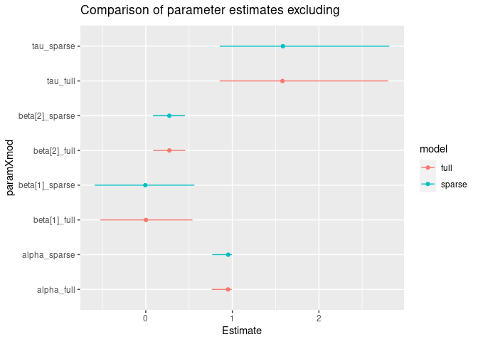
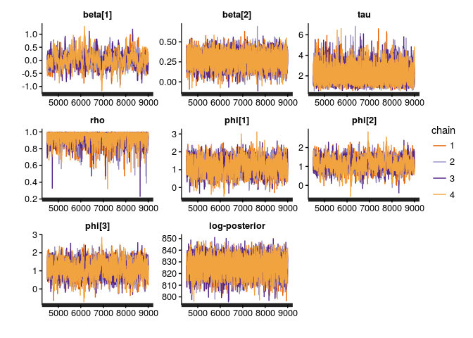
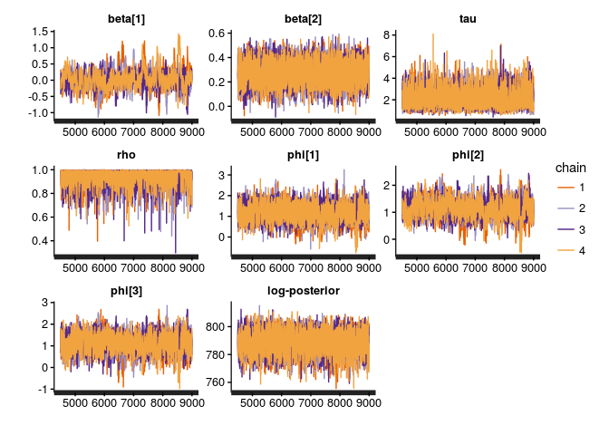
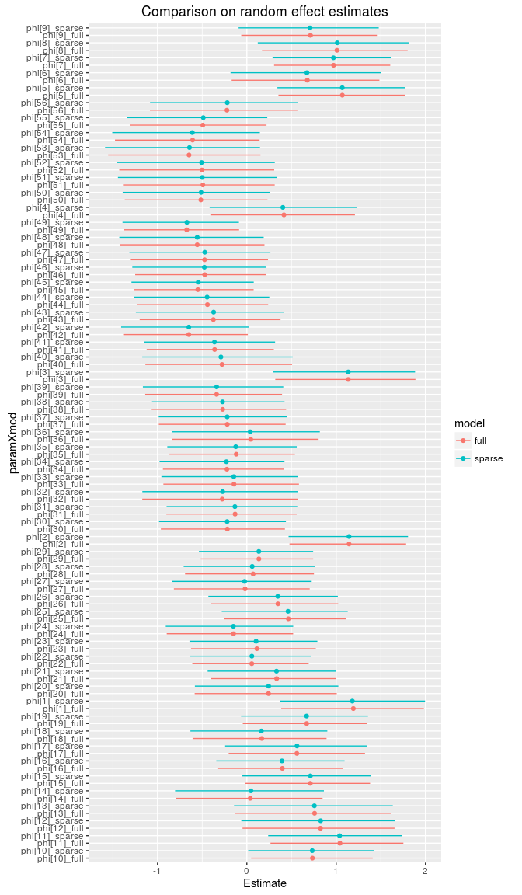
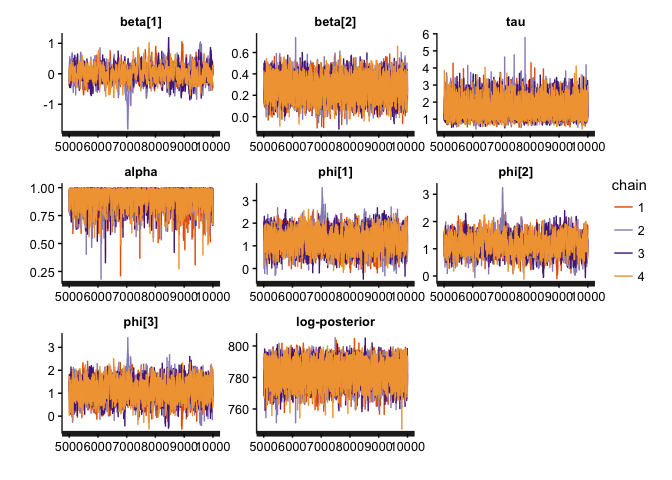

# Exact sparse CAR models in Stan
Max Joseph  
August 20, 2016  

## About 

This document details sparse exact conditional autoregressive (CAR) models in Stan as an extension of previous work on approximate sparse CAR models in Stan. 
Sparse representations seem to give order of magnitude efficiency gains, scaling better for large spatial data sets. 

## Background

Conditional autoregressive (CAR) models are popular as prior distributions for spatial random effects with areal spatial data. 
For instance if we have a Poisson likelihood with spatial random effects: 

$$y_i \sim \text{Poisson}(\text{exp}(X_{i}^T \beta + \phi_i + \log(\text{offset}_i)))$$

where $X$ is a design matrix, $\beta$ is a vector of coefficients, and $\phi_i$ is a spatial adjustment  for locations $i=1, ..., n$. 
In a CAR model, the conditional distribution of the spatial random effect $\phi_i$ is univariate normal with an expected value that is a function of the spatial adjustments of the other locations:

$$\phi_i \mid \phi_j, j \neq i \sim \text{N}(\rho \sum_j b_{ij} \phi_j, \tau_i^2)$$

Here $\rho$ is a parameter that ensures propriety of the joint distrbution of $\phi$ (Gelfand & Vounatsou 2003).
The joint distribution of the vector of spatial random effects is multivariate normal: 

$$ \phi \sim \text{N}(0, [D_\tau (I - \rho B)]^{-1})$$

where $D_\tau = \text{diag}(\tau_i)$, and $\tau_i$ is a precision parameter. 
If the precision is constant spatially, then $\tau$ is a scalar and $D_\tau = \tau D$ where $D = \text{diag}(m_i)$ and $m_i$ is the number of spatial neighbors for location $i$. 
$I$ is an $n \times n$ identity matrix, and $B = D^{-1} W$ where $W$ is the map adjacency matrix ($w_{ii} = 0, w_{ij} = 1$ if $i$ is a neighbor of $j$, and $w_{ij}=0$ otherwise).
In most applications, $W$ tends to be sparse.

When $\tau$ is a scalar, this multivariate normal prior can be rewritten as: 

$$ \phi \sim \text{N}(0, [\tau (D - \rho W)]^{-1})$$

where $\tau (D - \rho W)$ is the precision matrix $\Sigma^{-1}$.

such that the log probability of $\phi$ is: 

$$\log(p(\phi \mid \tau, \rho)) = - \frac{n}{2} \log(2 \pi) + \frac{1}{2} \log(\text{det}( \Sigma^{-1})) - \frac{1}{2} \phi^T \Sigma^{-1} \phi$$

We only need the log posterior up to an additive constant so we can drop the first term. 
Then, we'll substitute in $\tau (D - \rho W)$:

$$\frac{1}{2} \log(\text{det}(\tau (D - \rho W))) - \frac{1}{2} \phi^T \Sigma^{-1} \phi$$

$$ = \frac{1}{2} \log(\tau ^ n \text{det}(D - \rho W)) - \frac{1}{2} \phi^T \Sigma^{-1} \phi$$

$$ = \frac{n}{2} \log(\tau) + \frac{1}{2} \log(\text{det}(D - \rho W)) - \frac{1}{2} \phi^T \Sigma^{-1} \phi$$

## Fast exact determinant calculations

Previous implementations in Stan have benefitted from sparse representations to expedite computation of $\phi^T \Sigma^{-1} \phi$, and have also used approximations to avoid explicit computation of the determinant, e.g., this implementation from Kyle Foreman: https://groups.google.com/d/topic/stan-users/M7T7EIlyhoo/discussion

Jin, Carlin, and Banerjee (2005) present a clever and efficient way to compute the determinant term that does not rely on any approximations:

$$\text{det}(D - \rho W) \propto \prod_{i = 1}^n (1 - \rho \lambda_i)$$

where $\lambda_1, ..., \lambda_n$ are the eigenvalues of $D^{-\frac{1}{2}} W D^{-\frac{1}{2}}$, which can be computed ahead of time and passed in as data. 
Because we only need the log posterior up to an additive constant, we can use this result which is proportional up to some multiplicative constant $c$: 

$$\frac{n}{2} \log(\tau) + \frac{1}{2} \log(c \prod_{i = 1}^n (1 - \rho \lambda_i)) - \frac{1}{2} \phi^T \Sigma^{-1} \phi$$

$$= \frac{n}{2} \log(\tau) + \frac{1}{2} \log(c) +  \frac{1}{2} \log(\prod_{i = 1}^n (1 - \rho \lambda_i)) - \frac{1}{2} \phi^T \Sigma^{-1} \phi$$

Again dropping additive constants: 

$$\frac{n}{2} \log(\tau) + \frac{1}{2} \log(\prod_{i = 1}^n (1 - \rho \lambda_i)) - \frac{1}{2} \phi^T \Sigma^{-1} \phi$$

$$= \frac{n}{2} \log(\tau) + \frac{1}{2} \sum_{i = 1}^n \log(1 - \rho \lambda_i) - \frac{1}{2} \phi^T \Sigma^{-1} \phi$$

The determinant term can be computed efficiently in Stan using the `log1m` function.
The Stan implementation below is a direct extension of Kyle Foreman's sparse approximation (linked above), with two exceptions: 

1. determinant approximations are replaced with exact calculations
2. the spatial random effects are not artificially centered (this is a proper CAR model rather than an intrinsic autoregressive model - brute force centering is not necessary)

## Example: Scottish lip cancer data

To demonstrate this approach we'll use the Scottish lip cancer data example (some documentation [here](https://cran.r-project.org/web/packages/CARBayesdata/CARBayesdata.pdf)).

<!-- -->


```r
library(ggmcmc)
library(dplyr)
library(rstan)
rstan_options(auto_write = TRUE)
options(mc.cores = parallel::detectCores())
source('scotland_lip_cancer.RData')

# Define MCMC parameters 
niter <- 9000   # definitely overkill, but good for comparison
nchains <- 4
to_plot <- c('beta', 'tau', 'rho', 'phi[1]', 'phi[2]', 'phi[3]', 'lp__')
```


## Full model 

To fit the full model, we'll pull objects loaded with our Scotland lip cancer data. 
I'll use `model.matrix` to generate a design matrix, centering and scaling the continuous covariate `x` to reduce correlation between the intercept and slope estimates. 


```r
W <- A # adjacency matrix
D <- diag(rowSums(A))
scaled_x <- c(scale(x))
X <- model.matrix(~scaled_x)
  
full_d <- list(n = nrow(X),         # number of observations
               p = ncol(X),         # number of coefficients
               X = X,               # design matrix
               y = O,               # observed number of cases
               log_offset = log(E), # log(expected) num. cases
               W = W,               # adjacency matrix
               D = D)               # diagonal num. neighbor matrix

full_fit <- stan('stan/car_prec.stan', data = full_d, 
                 iter = niter, chains = nchains, verbose = FALSE)
print(full_fit, pars = c('beta', 'tau', 'rho', 'lp__'))
```

```
## Inference for Stan model: car_prec.
## 4 chains, each with iter=9000; warmup=4500; thin=1; 
## post-warmup draws per chain=4500, total post-warmup draws=18000.
## 
##           mean se_mean   sd   2.5%    25%    50%    75%  97.5% n_eff Rhat
## beta[1]   0.01    0.02 0.32  -0.62  -0.18   0.00   0.17   0.78   216 1.01
## beta[2]   0.28    0.00 0.09   0.10   0.22   0.28   0.34   0.45  4129 1.00
## tau       2.09    0.01 0.77   0.97   1.55   1.96   2.49   3.94  3945 1.00
## rho       0.95    0.00 0.05   0.81   0.93   0.96   0.98   1.00  2042 1.00
## lp__    826.36    0.15 7.40 810.89 821.63 826.62 831.53 839.99  2378 1.00
## 
## Samples were drawn using NUTS(diag_e) at Sun Aug 21 10:41:24 2016.
## For each parameter, n_eff is a crude measure of effective sample size,
## and Rhat is the potential scale reduction factor on split chains (at 
## convergence, Rhat=1).
```

```r
traceplot(full_fit, pars = to_plot)
```

<!-- -->

## Sparse implementation

For the sparse implementation, we first compute $\lambda_1, ..., \lambda_n$ (the eigenvalues of $D^{-\frac{1}{2}} W D^{-\frac{1}{2}}$), then generate a sparse representation for W (`Wsparse`), which is assumed to be symmetric, such that the adjacency relationships can be represented in a two column matrix where each row is an adjacency relationship between two sites. 


```r
# get eigenvalues of D^(-.5) * W * D^(-.5) for determinant computations
invsqrtD <- diag(1 / sqrt(diag(D)))
quadformDAD <- invsqrtD %*% W %*% invsqrtD
lambda <- eigen(quadformDAD)$values

# from Kyle Foreman's script:
Wsparse <- which(W == 1, arr.ind = TRUE)
Wsparse <- Wsparse[Wsparse[, 1] < Wsparse[, 2], ]  # removes duplicates

sp_d <- list(n = nrow(X),         # number of observations
             p = ncol(X),         # number of coefficients
             X = X,               # design matrix
             y = O,               # observed number of cases
             log_offset = log(E), # log(expected) num. cases
             W_n = nrow(Wsparse), # number of neighbor pairs
             W1 = Wsparse[, 1],   # column 1 of neighbor pair matrix
             W2 = Wsparse[, 2],   # column 2 of neighbor pair matrix
             D_sparse = diag(D),  # number of neighbors for each site
             lambda = lambda)     # eigenvalues of D^(-.5) * W * D^(-.5)

sp_fit <- stan('stan/car_sparse.stan', data = sp_d, 
               iter = niter, chains = nchains, verbose = FALSE)
print(sp_fit, pars = c('beta', 'tau', 'rho', 'lp__'))
```

```
## Inference for Stan model: car_sparse.
## 4 chains, each with iter=9000; warmup=4500; thin=1; 
## post-warmup draws per chain=4500, total post-warmup draws=18000.
## 
##           mean se_mean   sd   2.5%    25%    50%    75%  97.5% n_eff Rhat
## beta[1]  -0.02    0.01 0.26  -0.58  -0.16  -0.01   0.14   0.48   335 1.01
## beta[2]   0.28    0.00 0.09   0.10   0.22   0.28   0.34   0.45  4258 1.00
## tau       2.12    0.01 0.77   0.98   1.57   1.99   2.53   3.96  4424 1.00
## rho       0.95    0.00 0.05   0.80   0.93   0.96   0.98   1.00  4001 1.00
## lp__    788.93    0.12 7.24 773.91 784.27 789.17 793.93 802.29  3704 1.00
## 
## Samples were drawn using NUTS(diag_e) at Sun Aug 21 10:41:40 2016.
## For each parameter, n_eff is a crude measure of effective sample size,
## and Rhat is the potential scale reduction factor on split chains (at 
## convergence, Rhat=1).
```

```r
traceplot(sp_fit, pars = to_plot)
```

<!-- -->

### MCMC Efficiency comparison
 
The main quantity of interest is the effective number of samples per unit time. 
Sparsity gives us an order of magnitude or so gains, mostly via reductions in run time. 


Model     Number of effective samples   Elapsed time (sec)   Effective samples / sec)
-------  ----------------------------  -------------------  -------------------------
full                         2377.547            407.95057                   5.828026
sparse                       3703.699             27.89633                 132.766565

### Posterior distribution comparison

Let's compare the estimates to make sure that we get the same answer with both approaches. 
In this case, I've used more MCMC iterations than we would typically need in to get a better estimate of the tails of each marginal posterior distribution so that we can compare the 95% credible intervals among the two approaches. 

\newpage

<!-- -->

\newpage

<!-- -->

The two approaches give the same answers (more or less, with small differences arising due to MCMC sampling error). 

\newpage

### Stan model statement: CAR with `multi_normal_prec`


```
data {
  int<lower = 1> n;
  int<lower = 1> p;
  matrix[n, p] X;
  int<lower = 0> y[n];
  vector[n] log_offset;
  matrix<lower = 0, upper = 1>[n, n] W;
  matrix<lower = 0>[n, n] D;
}
transformed data{
  vector[n] zeros;
  zeros = rep_vector(0, n);
}
parameters {
  vector[p] beta;
  vector[n] phi;
  real<lower = 0> tau;
  real<lower = 0, upper = 1> rho;
}
model {
  phi ~ multi_normal_prec(zeros, tau * (D - rho * W));
  beta ~ normal(0, 1);
  tau ~ gamma(0.5, .0005);
  y ~ poisson_log(X * beta + phi + log_offset);
}
```

\newpage

### Stan model statement: sparse exact CAR


```
data {
  int<lower = 1> n;
  int<lower = 1> p;
  matrix[n, p] X;
  int<lower = 0> y[n];
  vector[n] log_offset;
  int W_n;                // number of adjacent region pairs
  int W1[W_n];            // first half of adjacency pairs
  int W2[W_n];            // second half of adjacency pairs
  vector[n] D_sparse;     // diagonal of D (number of neigbors for each site)
  vector[n] lambda;       // eigenvalues of invsqrtD * W * invsqrtD
}
parameters {
  vector[p] beta;
  vector[n] phi;
  real<lower = 0> tau;
  real<lower = 0, upper = 1> rho;
}
model {
  row_vector[n] phit_D; // phi' * D
  row_vector[n] phit_W; // phi' * W
  vector[n] ldet_terms;

  // From Kyle Foreman:
  // (phi' * Tau * phi) = tau * ((phi' * D * phi) - rho * (phi' * W * phi))
  phit_D = (phi .* D_sparse)';
  phit_W = rep_row_vector(0, n);
  for (i in 1:W_n) {
    phit_W[W1[i]] = phit_W[W1[i]] + phi[W2[i]];
    phit_W[W2[i]] = phit_W[W2[i]] + phi[W1[i]];
  }

  // prior for phi
  for (i in 1:n) ldet_terms[i] = log1m(rho * lambda[i]);
  target += 0.5 * n * log(tau)
          + 0.5 * sum(ldet_terms)
          - 0.5 * tau * (phit_D * phi - rho * (phit_W * phi)) ;
  
  beta ~ normal(0, 1);
  tau ~ gamma(0.5, .0005);
  y ~ poisson_log(X * beta + phi + log_offset);
}
```

\newpage

## References

Jin, Xiaoping, Bradley P. Carlin, and Sudipto Banerjee. "Generalized hierarchical multivariate CAR models for areal data." Biometrics 61.4 (2005): 950-961.

Gelfand, Alan E., and Penelope Vounatsou. "Proper multivariate conditional autoregressive models for spatial data analysis." Biostatistics 4.1 (2003): 11-15.
